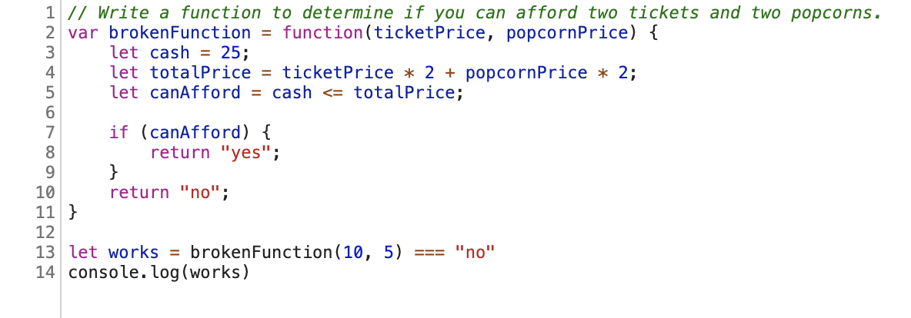
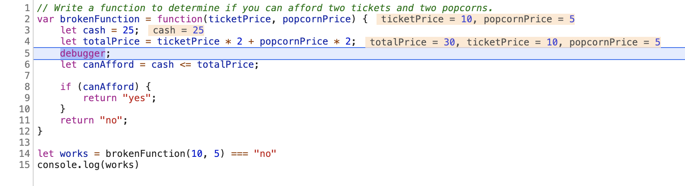

# README

## Completing This Assignment
There are two parts to this assignment: the Debugging Process and the Final Results. When you are done or the time is up (whichever comes first), you will submit both. There are **two deliverables, a pull request and a submitted Google form**.

## Getting Started
1. Fork this repo
2. Clone down your fork to your local computer
3. Open the repo in VSCode
4. In your terminal, start the server (the start script is in the `package.json` file)
5. Complete the Debugging Process below
6. When you're done, fill out the Google Form and make a pull request to this repo.

## Debugging Process
This is the primary focus of the assignment. Please fill out the `DebuggingProcess.md` file, which includes a template that you will use for every debugger process.

### General Steps:
  1. Identify which bug you are attempting to fix. There are three bugs total and three broken tests. Some bugs will affect more than one test. Find that section in the DebuggingProcess.txt file.
  2. Identify where you would like to put your debugger statement in order to find the source of the bug.
  3. Fill out **every step** of the template (copy/paste the template again as needed) for this debugger.
  4. Evaluate your results:
      1. If you have not found the bug, go back to step 2 and fill out the form again for a new debugger statement.
      2. If you have found the bug and documented it properly (at least 2 debugger forms per broken test), go back to step 1 for a new broken test.
      3. If you have finished the process for all bugs, commit your work and submit a pull request, then complete the Final Results form.

### Rules:
- No console logs allowed
- You are required to fill out **at least two debugger processes per bug**, even if you are able to tell what the bug is without engaging in the process. If you already found the bug on your first try, fill out the debugger process again on another line of your choosing and confirm your understanding.
- Fill out the debugger process for **every debugger statement that you use**. If you use ten, fill out the process ten times. If there is one debugger but it is hit multiple times (for example, in a for loop), fill out the relevant sections (hypothesis, screenshot, comparison) as many times as needed.

### FAQs:
  1. I already see the bug - can I skip the process and just write down the answer? **No. You are required to fill out at least two debugger processes per bug. Choose two lines in the code and confirm your understanding.**
  2. I filled out the process once for a bug, but then I found the answer. I'm done with that bug, right? **No. You are required to fill out at least two debugger processes per bug. Choose another line in the code and confirm your understanding.**
  3. I filled out the debugger process twice for this bug but I couldn't find it. Can I just work normally from now on? **No. You are required to fill out the debugger process at every single step.**
  4. Why do we need to fill out the Google Form if we're already doing the debugger process? **This helps us get high-level stats quickly before we dive into each student's submission.**
  5. In what order should I fill out the Google Form? In the order I fixed the bugs? **In numerical order, for example line 1, 100, and 200.**
  6. I can't get my debugger statements to work. Can I just use console logs? **No, please submit a help desk ticket and we will help you debug the debugger.**
  7. I didn't finish all the bugs, is that ok? **Yes! Please prioritize the process over the answer.**

### Example:
  

  1. On what line (compared to the original code) will you put the debugger? Compare to the original code so that your line of code is not influenced by previous debugger statements.

  I will put a debugger on line 5.

  2. Why did you choose this line?

  I suspect that I am not calculating the total price correctly. I want to put a debugger on line 5 so that I can see the value of `totalPrice`.

  3. What is your hypothesis for what the state of the program will be when you hit this debugger? For example, will it hit the debugger at all? What values will the variables have?

  My hypothesis is that `totalPrice` will not equal 30, which is what it should equal. I might be coding the order of operations wrong and I want to test that theory.

  4. When it hits the debugger, take a screenshot (ideally showing the updated values) and paste that here.
  

  5. Compare the results revealed by your debugger statement with your hypothesis. Were you correct? How does this influence your next step?

  Wow, the debugger shows that `totalPrice` does equal 30, which means that's not where the bug was, so I was wrong. The other values also look correct, meaning that the bug must occur later in the function. Next, I want to see if I am comparing `cash` and `totalPrice` correctly.

## Final Results
Make a pull request to this repo and submit your findings in a Google Form, linked here: https://forms.gle/tUnLqZkE2RuTWVBQ8

